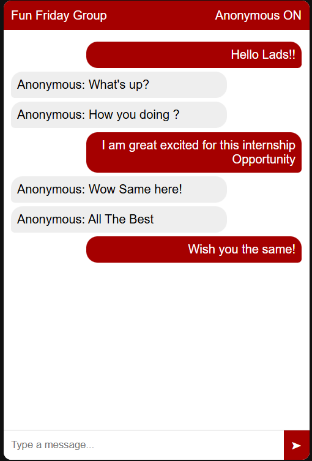
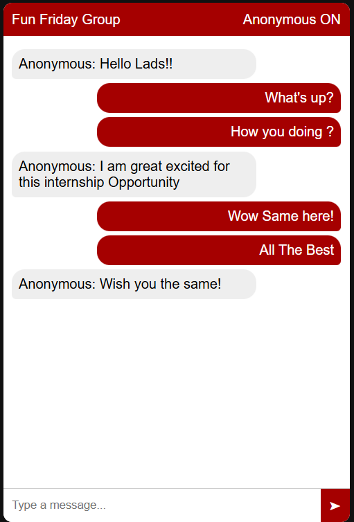

# 💬 Chatbox GUI

<div align="center">


**A beautiful real-time group chat application with WebSocket and MySQL integration**

[🚀 Demo](#-demo) • [📋 Features](#-features) • [🛠️ Installation](#️-installation) • [💻 Usage](#-usage)

</div>

---

## 🚀 Demo

Experience real-time messaging with a sleek, anonymous chat interface that connects users instantly through WebSocket technology.

## 📸 Screenshots

<div align="center">

### 💬 Chat Interface Demo





_Real-time chat with anonymous messaging - your messages appear on the right with red background, others on the left_

**Key Features Shown:**

- 🔴 **Your messages**: Red background, positioned on the right
- 💬 **Other messages**: Gray background, positioned on the left
- 👤 **Anonymous messaging** for all users
- 🎨 **Clean, modern chat bubble** design
- ⌨️ **Enter key support** for quick messaging
- 📱 **Responsive design** that works on all devices

</div>

## ✨ Features

- 💬 **Real-time messaging** using WebSocket technology
- 👤 **Anonymous chat** functionality for privacy
- 🗄️ **MySQL database** integration for message persistence
- 🎨 **Clean and responsive** UI design with modern chat bubbles
- ⚡ **Instant message delivery** to all connected users
- 📱 **Mobile-friendly** interface
- 🔴 **Personalized message styling** - your messages appear on the right with red background
- ⌨️ **Enter key support** for quick message sending
- 🎯 **Smart message positioning** - sent messages on right, received on left

## 🛠️ Prerequisites

Before running this application, make sure you have:

-  **Node.js** (v14 or higher)
-  **MySQL** database
-  **npm** or **yarn**

## 🚀 Installation

### 1️⃣ Clone the repository

```bash
git clone https://github.com/firozzorif/Chatbox-GUI.git
cd Chatbox-GUI
```

### 2️⃣ Install dependencies

```bash
npm install
```

### 3️⃣ Set up MySQL database

Create the required database and user:

```sql
CREATE DATABASE chatapp;
CREATE USER 'chatuser'@'localhost' IDENTIFIED BY 'chatpass123';
GRANT ALL PRIVILEGES ON chatapp.* TO 'chatuser'@'localhost';
FLUSH PRIVILEGES;

USE chatapp;
CREATE TABLE messages (
    id INT AUTO_INCREMENT PRIMARY KEY,
    group_id INT NOT NULL,
    user_id INT NOT NULL,
    message TEXT NOT NULL,
    created_at TIMESTAMP DEFAULT CURRENT_TIMESTAMP
);
```

### 4️⃣ Start the server

```bash
npm start
```

### 5️⃣ Open your browser

Open the `index.html` file in your browser or use a live server to test and chat. The server runs on `localhost:3000`.

## 💻 Usage

1. 🌐 **Open** the application in your browser
2. ✍️ **Type** messages in the input field
3. 📤 **Send** by pressing Enter or clicking the send button
4. 👥 **See** messages appear in real-time for all users
5. 💾 **Messages** are automatically stored in the database

## 🛠️ Technologies Used

### 💻 Backend


### 🎨 Frontend


## 📁 Project Structure

```
Chatbox-GUI/
├── 📄 server.js          # WebSocket server with MySQL integration
├── 🌐 index.html         # Main chat interface
├── 🎨 style.css          # Styling for the chat UI
├── ⚡ script.js          # Client-side WebSocket handling
├── 📦 package.json       # Dependencies and scripts
├── 🚫 .gitignore         # Git ignore rules
└── 📖 README.md          # Project documentation
```

## 🤝 Contributing

Contributions are welcome! Feel free to:

1. 🍴 Fork the project
2. 🌟 Create your feature branch (`git checkout -b feature/AmazingFeature`)
3. 💾 Commit your changes (`git commit -m 'Add some AmazingFeature'`)
4. 📤 Push to the branch (`git push origin feature/AmazingFeature`)
5. 🔄 Open a Pull Request

## 📝 License

This project is licensed under the MIT License - see the [LICENSE](LICENSE) file for details.

## 👨‍💻 Author

**Firoz Zorif**

- GitHub: [@firozzorif](https://github.com/firozzorif)

---

<div align="center">

**⭐ Star this repo if you found it helpful!**

Made with ❤️ by [Firoz Zorif](https://github.com/firozzorif)

</div>
